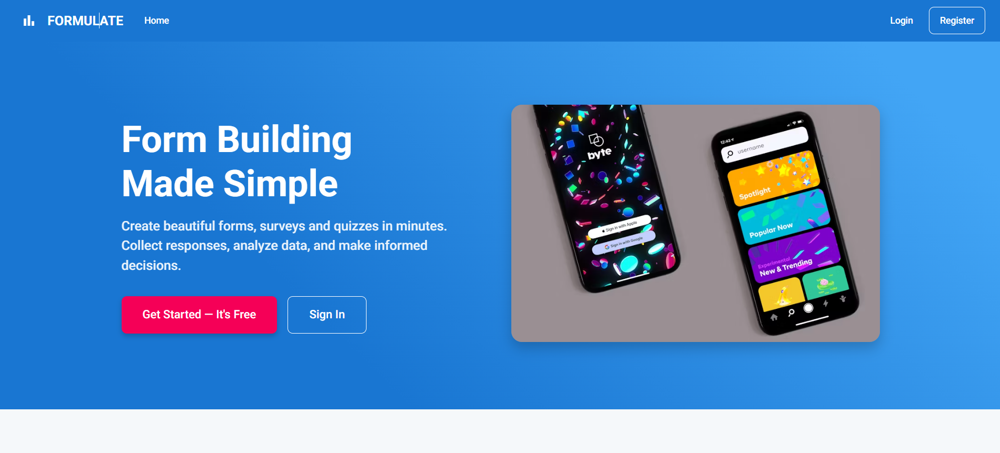
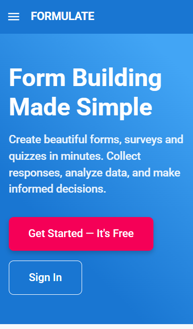

# Formulate - Modern Form Builder & Survey Solution



## About Formulate

Formulate is a powerful, full-stack form builder application that allows users to create custom forms, surveys, and data collection tools without writing a single line of code. Built with the MERN stack (MongoDB, Express, React, Node.js), Formulate provides an intuitive drag-and-drop interface for creating professional forms with advanced features.

### Key Capabilities

- **Visual Form Builder:** Create professional forms with an intuitive drag-and-drop interface
- **Diverse Field Types:** Use text, email, number, dropdown, checkbox, radio button, and rating fields
- **Multi-page Forms:** Create forms with multiple pages and progress indicators
- **Conditional Logic:** Show or hide fields based on user responses
- **Real-time Preview:** Test your forms as you build them
- **Response Collection:** Gather and manage form submissions securely
- **Response Analytics:** View submission statistics and download response data
- **Form Sharing:** Generate unique links for distributing your forms
- **Access Control:** Protect forms with password options
- **Mobile Responsive:** Full functionality across all device sizes

## Mobile Optimized Experience

Formulate is built with a mobile-first approach, ensuring seamless form building and submission on any device.



## Technology Stack

### Frontend
- **React.js** - Component-based UI library
- **Material-UI** - React component library with responsive design
- **React Router** - Client-side routing
- **React Beautiful DnD** - Drag-and-drop functionality
- **Axios** - HTTP client for API requests
- **Context API** - State management

### Backend
- **Node.js** - JavaScript runtime environment
- **Express.js** - Web application framework
- **MongoDB** - NoSQL database
- **Mongoose** - Object Data Modeling (ODM) library
- **JWT** - JSON Web Token authentication
- **Bcrypt** - Password hashing

### Development & Deployment
- **Webpack** - Module bundling
- **Babel** - JavaScript compiler
- **ESLint** - Code quality tool
- **Vercel** - Deployment platform

## Directory Structure

```
formulate/
│
├── client/                 # Frontend React application
│   ├── public/             # Static files
│   ├── src/                # Source files
│   │   ├── api/            # API service functions
│   │   ├── components/     # React components
│   │   │   ├── FormBuilder/  # Form builder components
│   │   │   └── FormFields/   # Form field components
│   │   ├── context/        # React Context providers
│   │   ├── pages/          # Page components
│   │   ├── utils/          # Utility functions
│   │   └── App.js          # Main application component
│   └── package.json        # Frontend dependencies
│
├── server/                 # Backend Node.js/Express application
│   ├── controllers/        # Request handlers
│   ├── middleware/         # Express middleware
│   ├── models/             # Mongoose data models
│   ├── routes/             # API routes
│   ├── utils/              # Utility functions
│   ├── index.js            # Server entry point
│   └── package.json        # Backend dependencies
│
├── assets/                 # Project images and assets
└── README.md               # Project documentation
```

## Getting Started

### Prerequisites
- Node.js (v14 or higher)
- MongoDB (v4 or higher)
- npm or yarn

### Installation

1. Clone the repository
   ```
   git clone https://github.com/your-username/formulate.git
   cd formulate
   ```

2. Install server dependencies
   ```
   cd server
   npm install
   ```

3. Install client dependencies
   ```
   cd ../client
   npm install
   ```

4. Configure environment variables
   - Create a `.env` file in the `/server` directory with:
     ```
     MONGO_URI=your_mongodb_connection_string
     JWT_SECRET=your_jwt_secret
     PORT=5000
     ```

5. Start the backend server
   ```
   npm run dev
   ```

6. Start the frontend application
   ```
   npm start
   ```

7. Open your browser and navigate to `http://localhost:3000`

## Live Demo

Experience Formulate in action: [Formulate Demo](https://formulate-demo.vercel.app) (coming soon)

## Deployment

Formulate is deployed using Vercel for both frontend and backend:

- Frontend: Deployed directly from the GitHub repository
- Backend: Deployed as a Vercel Serverless Function

## License

This project is licensed under the MIT License - see the [LICENSE](LICENSE) file for details.

## Contributing

Contributions are welcome! Please feel free to submit a Pull Request. 